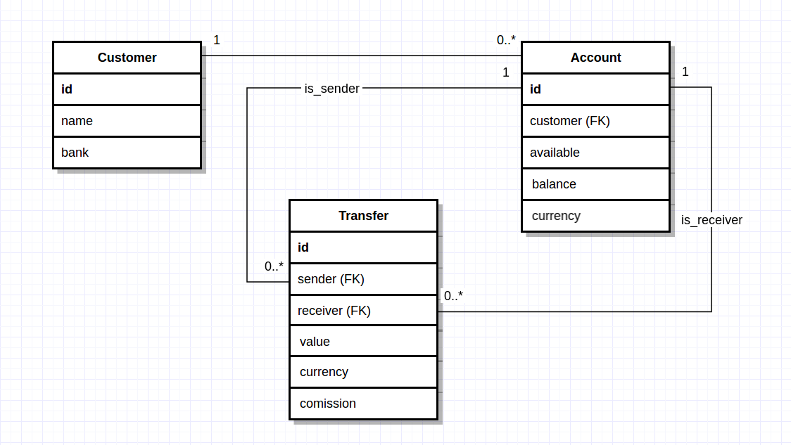

# Overview

## Part 1

See the [data model](#data-model)

## Part 2

The bank server has been developed over a cowboy HTTP server. A node is started for each bank (in this case Bank_A and Bank_B), and they communicate via HTTP to consolidate _external_ transactions.

The transfer assistant is a Phoenix server. It is still under construction and no web interface is provided. The module `Assistant.Banks` connects to the banks' HTTP API to order and retrieve transfers.

To launch the demo, execute
```
$ ./demo.sh compile
```

and then

```
$ ./demo.sh launch
```

## Part 3

**How​ would​ you​ improve​ your​ solution?​ What​ would​ be​ the​ next​ steps?**

The part that requires most work is the Phoenix server, as very little work has been done here. In this sense, the next step would be to give the assistant a web interface from where transfers can be ordered and viewed.

**After implementation, is there any design decision that you would have done different?**

Because this is a demo, I should have lessened the requirements on the architecture of the bank server, in order to free some time to give the transfer assistant a web interface.

I have used ETS tables as the storage implementation, which means the database is destroyed every time the servers are restarted. Using DETS would have taken almost the same time and would have allowed for persistence.

The implementation of the Data Access Layer in the module `bn_dal.erl` is extremely verbose and would probably benefit from some refactoring.

**How would you adapt your solution if transfers are not instantaneous?**

The solution is already capable of handling non-instantaneous transactions. Timestamps are stored for each transaction, helping determine its state:

- **created**: The transaction has been created and the sender's available balance deducted.
- **preconsolidated**: The consolidation process has started (eg. a call has been made to an external bank's servers). The transaction remains in this state until confirmation is received, at which point the transaction enters the _consolidated_ state.
- **consolidated**: The transaction is completed. The sender's real balance is deducted and the receiver's available and real balance are increased.

The code responsible for this can be seen at line 107 of module `bank/src/bn_logic.erl`:

```erlang
transfer_sm(consolidate, Transfer = #{type := Type}, Ctx) ->
  case Type of
    internal ->
      consolidate_internal(Transfer);
    external ->
      #{external := Bank} = Ctx,
      case bn_comm:consolidate(Bank, Transfer) of
        {ok, Updated} ->
          consolidate_external_out(Updated);
        {wait, PreConsolidated} ->
          {ok, PreConsolidated};
        {error, Reason} ->
          fail(Transfer),
          {error, {consolidation_failed, #{reason => Reason}}}
      end
  end.
```

# Bank

Bank is an erlang application set on top of a Cowboy server. It is a _toy_ banking server, which provides the following functionality:

- Making **transfers**. Money can be transferred between accounts of the same bank or to accounts in other banks. Other bank servers can be launched to simulate a network of banks. For now, only transactions in Euros are allowed, but other currencies can be added by refactoring only two functions; `bn_cer:cer/2` and `bn_cer:available/1`.
- Retrieving transfers linked to an account

Customers can be registered and accounts opened by using the erlang API defined in `bank.erl`.

**Compilation**

You'll need [rebar3 and erlang](https://www.rebar3.org/docs/getting-started). Tested for versions 19+ of Erlang.

To compile, simply run

```
rebar3 compile
```

To execute in a shell,

```
rebar3 run
```

By default, the server listens on port `8000`. The *port* and *bank code* (ie. IBAN Institution Code) can be set up through config files (examples can be found in the `priv/` directory).


## Data Model

### Conceptual Data Model

Conceptually, banks have customers, and customers have accounts with which they make transactions,


### Logical Data Model

Because each bank holds the information of its customers and their accounts in its own database, the logical model differs slightly from the conceptual one,



### Physical Data Model

The physical data model is completely dependant on the database implementation. In this case, because erlang ETS tables were used, the physical model is as follows,

```erlang
-record(transfer,
        {
          id :: binary(),
          type :: bn_model:transfer_type(),
          sender :: binary(),
          receiver :: binary(),
          value :: non_neg_integer(),
          currency :: binary(),
          commission = 0 :: non_neg_integer(),
          created :: integer(),
          preconsolidated = null :: integer() | null,
          consolidated = null :: integer() | null,
          failed = null :: integer() | null
        }).

-record(customer,
        {
          id :: binary(),
          name :: binary(),
          created :: non_neg_integer()
        }).

-record(account,
        {
          id :: binary(),
          customer :: binary(),
          available = 0 :: integer(),
          balance = 0 :: integer(),
          currency = <<"EUR">> :: binary(),
          created :: integer()
        }).
```

## Architecture


The system is highly modular and great emphasis has been placed on allowing it to be easily expandible.

There is a strong separation between the physical and logical models, to the point that if a different database software is desired, only the module `bn_db.erl` must be refactored. An in-house database implementation was chosen as a self-contained solution was required. Using a database like Postgres or MySQL would have required the tester to further download and configure packages.

New **transaction types** can be added with little to no effort. Multi-currency support can be added by modifying only two functions in the `bn_cer.erl` module.

## API

The _bank_ server offers a HTTP JSON API with three resources,

- `/transfers` to order transactions
- `/:iban/transfers` to fetch the transfers linked to an account
- `/interbank/consolidations` used by other _bank_ servers to communicate an inbound transaction

### /transfers

Used to order transactions. For example, to send 1 Euro from account `ESXX000A1` to account `ESXX000B2`, we would do,

```
HTTP/1.1 POST http://localhost:8001/transfers
Content-Type: application/json
{
    "currency": "EUR",
    "receiver": "ESXX000B2",
    "sender": "ESXX000A1",
    "value": 100
}
```

Field `value` is set in cents (eg. 1.23 EUR would be 123). All fields are mandatory.

### /:iban/transfers

Used to retrieve the transactions linked to an account. For example,

```
HTTP/1.1 GET http://localhost:8002/ESXX000B2/transfers
{
    "currency": "EUR",
    "receiver": "ESXX000B2",
    "sender": "ESXX000A1",
    "value": 100
}
```

would result in
```
HTTP/1.1 200 OK
[
    {
        "commission": 0,
        "consolidated": 1515910444,
        "created": 1515910444,
        "currency": "EUR",
        "failed": null,
        "id": "1804120628",
        "preconsolidated": null,
        "receiver": "ESXX000B2",
        "sender": "ESXX000B1",
        "type": "internal",
        "value": 100
    }
]
```

# Assistant
